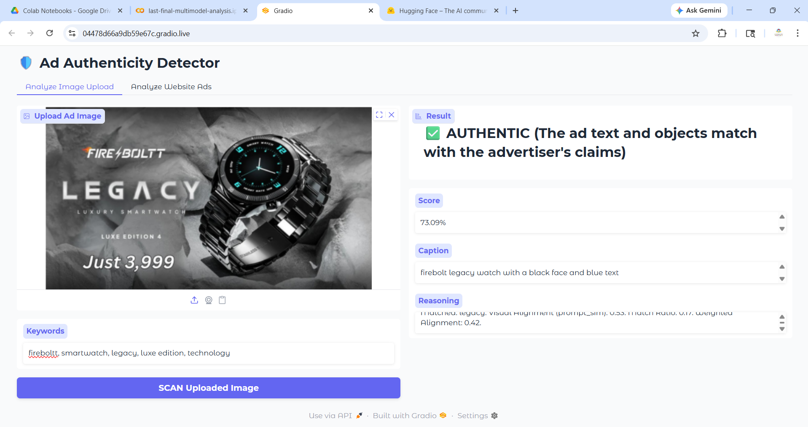

# Ads Authenticity Detection Using MultiModal

A machine learning project that analyzes advertisements using multimodal data (text + visual/content-based features of ads) to identify ads image or website URL into 3 major categories 'Authentic', 'Suspicious' and 'Mismatch' advertisements.

## Features
- Multimodal advertisement analysis
- Data preprocessing and feature extraction
- Authenticity prediction system from self-made dataset of 133 images from various ads on technology items
- Performance evaluation

## Technologies Used
- Python
- Pandas
- Google Colab
- EasyOCR
- RapidFuzz
- TextBlob
- Scikit-learn
- Google Sheets
- CLIP (Contrastive Language-Image Pre-training)
- BLIP / BLIP-2 (Bootstrapping Language-Image Pre-training)
- YOLOv8 (ultralytics)
- PyTorch
- BeautifulSoup
- OpenCV
- Pillow
- Gradio
- Google Colab Tools(google.colab.auth, gspread)

## Project Workflow
1. Data collection
   - Batch Dataset Processing
   - Web Scraping Pathway
2. Muli-Modal Feature Extraction
   - Text Extraction (EasyOCR) & spelling correction (RapidFuzz & TextBlob)
   - Object detection (YOLOv8)
   - Image Captioning (BLIP-2 (Salesforce/blip2-opt-2.7b))
   - Deep Visual Alignment (CLIP (ViT-B-32))
4. Scoring & Alignment Engine
5. Weighted Decision & Guardrail Logic
6. Prediction and evaluation
7. Interface & Evaluation Output

## System Architecture & Multimodal Pipeline

To determine an advertisement's authenticity, the system processes a raw ad image through four parallel feature extraction branches:

```text
┌──► OCR (EasyOCR + OpenCV) ──────► Extracted Ad Text Keywords
                  │
                  ├──► Object Detection (YOLOv8) ───► Detected Physical Objects
Raw Ad Image ────┼
                  ├──► Image Captioning (BLIP-2) ───► Semantic Image Caption
                  │
                  └──► Visual Embedding (CLIP) ─────► Dense Visual Vector
```


## Key Insights & System Innovations

### 1. Multi-Modal Verification Strategy
Relying on a single data medium (e.g., text-only or image-only) fails to catch sophisticated advertising mismatches. By processing advertisements through a **parallel four-pronged multi-modal pipeline**, the system simultaneously extracts visual embeddings, real-time localized objects, OCR text, and semantic descriptions. True authenticity is determined only when the visual reality aligns with textual claims.

### 2. Deep Visual-Semantic Calibration (CLIP)
* **Raw Score Normalization:** Raw cosine similarity scores from CLIP (`ViT-B-32`) naturally cluster between $0.2$ and $0.4$. The system maps and calibrates these scores using standard feature scaling:
  $$\text{Calibrated Score} = \text{clip}\left(\frac{\text{Raw Score} - 0.15}{0.25}, 0, 1\right)$$
  This shifts the outputs onto a human-interpretable $0 \text{ to } 100\%$ confidence scale without losing mathematical variance.
* **Dual-Query Vector Anchoring:** The system checks the image vector against both the advertiser's target keywords and an adversarial baseline of `AUTHENTICITY_PROMPTS` (*"genuine branded high quality product"* vs. *"fake cheap scam product"*), catching deceptive visual styling.

### 3. Strict Semantic Guardrails & Overrides
Algorithmic classification scores can sometimes be artificially inflated by background elements. To combat this, the pipeline enforces a **hard conditional override switch**:
* Even if mathematically scored above the **$60\%$ authenticity threshold**, if user-defined keywords are provided but **fewer than two** match the generated `BLIP-2` image caption, a strict semantic guardrail overrides the output.
* The system flags a `SUSPICION REASON`, forcefully downgrades the classification to **SUSPICIOUS**, and caps the maximum confidence score to **$55\%$** to mandate a human-in-the-loop review.

### 4. Resilient Preprocessing & Fuzzy Text Alignment
* **Computer Vision Optimization:** Before processing text, raw images undergo grayscale conversion and adaptive binary thresholding (`THRESH_BINARY | THRESH_OTSU`) using OpenCV. This drastically reduces font artifacts and background noise for `EasyOCR`.
* **Lexical Soft-Matching:** Rather than strict string matching—which breaks due to minor OCR misspellings or plural variations—the system utilizes `RapidFuzz` (`fuzz.partial_ratio`) and `TextBlob` spelling corrections. This creates a flexible text-alignment layer that accurately measures intent rather than exact characters.

### 5. Automated E-Commerce Scraping & Live Web Integration
Beyond static dataset benchmarking via Google Sheets, the engine integrates an autonomous web scraping crawler. It uses `BeautifulSoup` to parse live URLs, dynamically resolve relative assets, filter out structural UI components (like tiny icons and placeholders), and batch-evaluate live landing page images via the `Gradio` UI interface.

## Model Evaluation & Results

The system implements a rigorous, automated verification pipeline that cross-checks multimodal image features against ground-truth labels provided via the Google Sheets API. Performance is evaluated using standard classification metrics generated via `scikit-learn`.

### 1. Classification Metrics & Performance

The core system categorizes advertisements into two primary operational statuses:
* **`GOOD` (Authentic):** The extracted visual objects, contextual text (OCR), and deep semantic representations firmly match the advertiser's claimed keywords.
* **`MISLEADING` (Suspicious/Mismatch):** Significant discrepancies exist between the image contents and the stated target keywords, or the system triggered a strict guardrail override due to an insufficient keyword match ratio in the captions.

#### 📈 System Performance Report
```text
===================================
🏆 FINAL SYSTEM RESULTS (MULTI-MODAL) 🏆
===================================
Overall Accuracy: 77.44%

Classification Report:
              precision    recall  f1-score   support

        GOOD       0.75      0.70      0.72        56
  MISLEADING       0.79      0.83      0.81        77
```
## 📱 Gradio Interface Walkthrough
Below is the live interactive interface where users can pass a raw web advertisement image or URL to get real-time authenticity classification and see the parallel system metrics:



## Future Improvements
- Deep learning integration
- Real-time ad verification
- Web application deployment
- Enhanced multimodal fusion techniques

## Repository Structure
- ads-auth-detection-main.ipynb
- requirements.txt
- README.md

## Author
Swarnim
